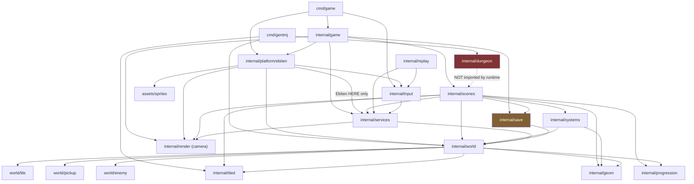
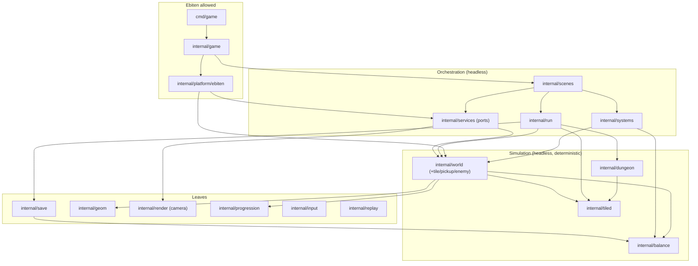

# Architecture Refactoring Plan

**Scope:** structural plan for evolving this repo from vertical-slice prototype to a codebase that scales through milestones M1–M8 in [completion-steps.md](completion-steps.md). Planning only — no code changes prescribed beyond file/package moves. All claims below are based on the repository as of this writing (~13,700 lines of Go under `internal/` + `cmd/`).

---

## Executive summary

**Current state.** The architecture is in better shape than most prototypes: ports & adapters are real and enforced (`internal/services` + `internal/platform/ebiten` + `internal/archtest`), the sim runs as an ordered `systems.Pipeline` with an authoritative event bus, world subpackages (`world/tile`, `world/pickup`, `world/enemy`) already carve out content tables, and core packages carry genuine test coverage (29 test files, including replay-determinism tests). `internal/game` is thin (142 lines) exactly as intended. The bones are good; the plan below is mostly about **finishing patterns that are 80% done**, not introducing new ones.

**Top 3 structural risks:**

1. **Sim logic leaking back into `PlayScene`.** Bombs and their explosions live entirely in `internal/scenes/play.go` (`ActiveBomb`, ~70 lines of fuse/explosion logic). This already causes real defects: bomb damage calls `w.DamageEnemy` directly and never emits `HitEvent`, so **a bomb kill on the boss never pays the boss coin bonus**, and because `Manager` is replace-only, **pausing destroys all lit bombs** (the bomb count was already decremented — the item silently vanishes). Chest opening in `handleActions` duplicates the `PickupEvent` reaction (the comment admits it). This is the same gravity well the Phase-3 `UpdateSim` extraction escaped; it is pulling code back in.
2. **Config/tuning triple bookkeeping.** Every player-tunable field exists in three hand-synced copies: `world.Player` (30+ fields), `save.GameSave` (30+ flat JSON fields), and `scenes.playerTuning` (297-line `run_state.go` that is ~90% field-copying). Adding one tunable touches 4+ files. Meanwhile gameplay constants still hide in the renderer (torch light radius 85, personal radius 35, night threshold 9600 that **disagrees with the sim's 10800**) and in systems (`enemyHurtCD`, night ×1.5 multipliers) — exactly the unfinished items in [parameterization-recommendations.md](parameterization-recommendations.md) §5–§9.
3. **The dungeon story has structurally drifted.** `internal/dungeon` is imported by **nothing at runtime** — only `cmd/gentmj`. README and completion-steps reference `dungeon.Result.BugDigest()` and `internal/dungeon/gen.go`, which do not exist; the pause "dungeon seed digest" and Tab graph overlay described in README are not in the code. M3 (prefab procgen dungeons) — the critical-path milestone — currently has no runtime integration point at all.

**Recommended north star:** keep the existing four-layer split — **scenes = orchestration, systems = sim behavior, world = sim state, platform = IO** — and make it *complete*: everything that mutates gameplay state during a tick goes through the pipeline and speaks events; every balance number lives in one of three homes (`world` defaults / `progression`+`balance` config / Tiled properties); the archtest grows from a ban-list into a full layered-import contract. No ECS, no new frameworks.

---

## Current architecture assessment

### Strengths (keep these)

- **Enforced boundaries.** `internal/archtest/imports_test.go` bans Ebiten, `internal/platform`, `internal/game`, embedded sprites, and `atotto/clipboard` from 12 core packages. It even pre-registers `internal/core` for future migration. This is rare discipline; the plan extends it rather than replacing it.
- **Systems pipeline + event bus.** `systems.Default()` runs Timers → Combat → Burn → Pickup → EnemyAI → Lock with documented ordering rationale (`pipeline.go` header). Events carry stable `world.EntityID`s, not slice indices. The scene translates events to SFX/shake/hit-stop in one place (`play.go reactToEvents`). This is the correct shape for everything M6 will add.
- **Replay determinism as a design constraint.** `internal/replay/doc.go` documents *why* determinism holds (no `time.Now`, no RNG in systems, pinned TPS, stable IDs) and `record_replay_test.go` proves it. This is a strategic asset for QA (§11 of completion-steps) — protect it.
- **Content tables in subpackages with a registry pattern.** `world/marker.go`'s `MarkerHandler` registry means new Tiled object types are one `registerMarker()` away. `world/pickup.Register`, `world/tile` GID defs, and `world/enemy.Config` follow the same shape. `aliases.go` keeps the external API stable.
- **Config progress.** `player_defaults.go` + `Effective*()` accessors, `progression.Config`/`Economy`, per-enemy Tiled props — sections 1–4 of the parameterization doc are genuinely done.
- **Asset pipeline.** Single source of truth (`assets/maps/*.tmj`, `//go:embed`), Tiled-compatible round-trip in `internal/tiled` with tests, in-engine editor writing the same files. Do not touch this.
- **Test culture.** `internal/world` alone has 10 test files; scenes have loader/run-state/progress tests; input bindings, tiled round-trip, dungeon properties, replay are covered. Untested areas are exactly the platform/adapters (acceptable) and `internal/save` (not acceptable — see roadmap).

### Pain points (evidence-based)

| # | Pain | Evidence |
|---|------|----------|
| P1 | **Bombs & flames simulated in the scene layer.** Fuse countdown, tile destruction, radial enemy damage, and flame particles run in `PlayScene.Update` (`play.go` lines ~114–219), not in the pipeline. Consequences: no `HitEvent` on bomb damage → **no boss bonus, no kill juice for bomb kills**; bombs are scene state → lost on pause (replace-only manager rebuilds `PlayScene` from its factory) and invisible to quicksave; bomb drawing is ~60 lines of procedural rects inside `PlayScene.Draw`. | `play.go`: `ActiveBomb`, `tryDropBomb`, Update loop; `register.go` factories; `reactToEvents` boss bonus keyed on `HitEvent.Killed` |
| P2 | **Tuning field triplication.** `world.Player` fields ↔ `save.GameSave` flat fields ↔ `scenes.playerTuning`, synced by hand in `run_state.go` (297 lines, four copy functions). | `internal/world/world.go` L131–176, `internal/save/save.go` L57–87, `internal/scenes/run_state.go` |
| P3 | **Renderer owns gameplay constants.** Torch light radius `85`, personal radius `35`, night alpha curve, and threshold `9600` live in `renderer.go` (L342–370); the sim says night ends at `10800` (`world.IsNight`). "Brighter torch" upgrades are currently impossible without editing the platform layer. Enemy draw size is hardcoded `14, 12` (L239) ignoring the authored `Hitbox`; sword/torch sweep animation hardcodes `t := (8-Swing)/7.0` — breaks silently if `SwingDuration ≠ 8`, which is a *persisted, tunable* field. | `internal/platform/ebiten/renderer.go`; parameterization doc §5–6 |
| P4 | **Residual global consts in systems.** `enemyHurtCD = 60`, `contactMargin`, night `×1.5` multipliers inline in `enemy_ai.go`; tree flame timer `90` inline in `world.TryIgniteTree`; `World.ShrineHeal` reaches for the global `progression.DefaultEconomy()` instead of configured state. | `internal/systems/enemy_ai.go` L28, L52–55; `internal/world/world.go` L623, L726 |
| P5 | **`internal/dungeon` orphaned at runtime; docs drifted.** Import graph: only `cmd/gentmj` imports it. README §"Bug reports" and completion-steps §0 reference `dungeon.Result.BugDigest()` / `gen.go` which don't exist; `title.go` still advertises "TAB in dungeon". The `dungeon` *map* is a hand-authored `.tmj` like every other map (`worldloader.go` doc comment: "there is no procedural / shell distinction"). | `go list` import graph; `internal/dungeon/` file list (growingtree, floorpaint, stamp only) |
| P6 | **`internal/scenes` is two packages in one.** 15 files / ~2,900 lines mixing (a) scene framework + concrete scenes and (b) run-state infrastructure: `session.go`, `map_progress.go`, `run_state.go`, `worldloader.go` (~860 lines that never draw anything). `editor.go` alone is 762 lines of UI panels + disk IO. | file sizes; `worldloader.go` doc header |
| P7 | **Hardcoded orchestration policy.** Respawn map `"field1"`, respawn HP `MaxHP/2 min 2`, door cooldowns `60`/`90` inline in `worldloader.go`; boss bonus applied in the scene event handler. Death loop is a known placeholder (completion-steps §2.4) but the values should already be data. | `internal/scenes/worldloader.go` L99, L148, L154–170 |
| P8 | **Minor layering warts.** `save` imports `world` (for `world.ItemSlot`) so the save codec isn't a leaf; `services` imports `world` + `render` (fat `DrawWorld(*world.World)` port — acceptable, but must be a *documented* exception); `world/enemy` imports `tiled` (content table coupled to codec — fine today, worth watching). | `go list` graph |
| P9 | **Allocation-heavy hot paths.** A* per enemy per tick builds `map[int]int` cameFrom + pointer heap items (`astar.go` L67–160); particles are `[]*Particle` with per-spawn allocations and per-frame filtering; `DrawWorld` iterates every map tile then rejects offscreen ones per-tile instead of clamping the loop to the viewport. Not a problem at 320×240 with 2 maps — will be at 5–15 screens + swarms (M2/M6). | `internal/world/astar.go`; `internal/scenes/particle.go`; `renderer.go` L197–218 |
| P10 | **Save package untested and pre-migration.** `save.Load` has ad-hoc fallbacks (legacy `has_bomb`) but no versioned migration table and no round-trip/golden tests — flagged by completion-steps §10.3 and §11.2, and about to matter for M5 ("track owned items in save with migrations"). | `internal/save/save.go` |

### Dependency graph (as-is)

Built from `go list` (arrows point at imports; stdlib omitted):



Highlighted: `dungeon` disconnected from the game binary; `save → world` inverted relative to where it should sit.

---

## Target architecture (6–12 months)

### Package responsibilities

| Layer | Package | Responsibility | Ebiten? |
|-------|---------|----------------|---------|
| Entry | `cmd/game`, `cmd/gentmj` | flags, window, `RunGame`; CLI tools | yes (cmd/game) |
| Wiring | `internal/game` | service bundle, App lifecycle. Stays ≤ ~200 lines forever. | yes |
| Platform | `internal/platform/ebiten` | the **only** Ebiten importer besides `game`/`cmd`: renderer, input, audio, assets, clipboard adapters | yes |
| Ports | `internal/services` | interfaces: Input, Audio, AssetCache, Renderer, Clipboard, TickRate. Documented exception: `Renderer.DrawWorld(*world.World)` keeps `services → world`. | no |
| Orchestration | `internal/scenes` | Scene interface, Manager, concrete scenes (title/play/pause/shop/editor/settings/inventory), event→juice translation | no |
| Run state | `internal/run` **(new, extracted from scenes)** | Session, RunState, MapProgress, worldloader (map/save/door/respawn orchestration) | no |
| Sim behavior | `internal/systems` | per-tick Systems incl. **Bomb, Hazard, Stamina** (migrated); event types + bus | no |
| Sim state | `internal/world` (+ `tile`, `pickup`, `enemy`) | World struct, entities, collision, A*, Tiled build, marker registry | no |
| Balance | `internal/balance` **(new)** | `GameBalance`: night/day config, hazard config, contact cadence, light radii defaults, respawn policy, juice presets; embedded `balance.json` + struct defaults | no |
| Procgen | `internal/dungeon` | graph gen + maze + floorpaint + **prefab room stitching → `tiled.Map`** (M3) | no |
| Leaves | `tiled`, `save`, `geom`, `render` (camera), `input`, `replay`, `progression` | codecs, math, bindings, camera | no |
| Guard | `internal/archtest` | full layered-import contract (see Architecture contract) | test-only |

**Deliberately absent:** `internal/core` (world subpackages already fill that role — remove the placeholder from archtest or keep it dormant), `internal/content` (Tiled props + registry tables are the content system; revisit only if non-Tiled content appears), any ECS/component framework.

### Dependency graph (to-be)



Key edges that change: `run → dungeon` (procgen finally reachable at runtime), `save → balance` replaces `save → world` (tuning struct defined once, below both), `scenes` loses `tiled`/`save` (delegated to `run`).

### Core data flow (one tick)

```
Input port (platform or replay.Playback)
  → PlayScene.Update: intents only (TrySwingSword, DropBomb intent, movement axis)
    → run.TryDoors / run.Respawn for orchestration transitions
    → systems.Pipeline.Tick(world, dt)
        Timers → Combat → Burn → Bomb → Hazard → Pickup → EnemyAI → Lock → Stamina
        systems mutate World, push Events (HitEvent, ExplosionEvent, …)
    → scene drains []Event → juice table: SFX, shake, hit-stop, particles, toasts
    → run.Session persistence marks (destroyed tiles, pickups, locks, shrines)
  → Draw: Renderer.DrawWorld(world) + scene HUD/overlay primitives (read-only)
```

The invariant to enforce in review: **scenes convert input to intents and events to feedback; they never compute damage, timers, or tile mutations.** Today's `play.go` violates this only for bombs/flames/shrine-touch/chests — a bounded, fixable list.

---

## Refactoring roadmap

Phases are shippable increments; the game stays playable after each. Effort: S ≤ 1 day, M ≈ 2–4 days, L ≈ 1–2 weeks (solo pace).

### Phase 0 — Truth-up: docs + architecture contract (S) ← *start next week*

Three tasks, no behavior change:

1. **Fix documentation drift.** Remove/correct README claims about `dungeon.Result.BugDigest()`, pause dungeon-seed digest, and Tab graph overlay; correct `internal/dungeon/gen.go` references in completion-steps §0/§1; fix stale `internal/world/tiledef.go` reference in the parameterization doc (now `world/tile/def.go`) and README's project-layout row for `internal/game` ("Scenes, input, draw, SFX" — it is none of those anymore).
2. **Upgrade archtest to a full layer map.** Replace the single ban-list with an explicit allowlist per package (see Architecture contract) and make the test **fail on any `internal/` package not classified** — so every future package must declare its layer. Keep the existing Ebiten/platform bans.
3. **Add `make check`** = `fmt + vet + test` (archtest runs inside `go test ./...` already) and make it the documented pre-commit gate; add CI if/when the repo gets one.

- **Risk:** none. **Validation:** `go test ./...` green; archtest failing on a deliberately misplaced import.
- **Success:** a new contributor (or future you) cannot add a mis-layered import or an unclassified package without a red test.

### Phase 1 — Bombs and flames become sim (M)

**Goal:** everything that changes gameplay state runs in the pipeline; `PlayScene` shrinks to intents + reactions.

- Move `ActiveBomb` to `world.World` (alongside `Flames`, which are already there); `PlayScene.tryDropBomb` becomes `world.TryPlaceBomb(...)` (intent) — mirrors existing `TrySwingSword`.
- New `systems.BombSystem`: fuse countdown, `World.BreakTileAt`, radial damage **via a shared damage helper that emits `HitEvent`** (fixes the missing boss-bonus/kill-juice bug). New event: `ExplosionEvent{TX, TY}` for scene VFX/SFX/shake.
- New `systems.HazardSystem`: absorb the flame-tick player damage currently in `systems/timers.go` plus flame lifecycle; `TryIgniteTree`'s inline `90` moves to config (Phase 2 will home it properly).
- Unify chest-open with the pickup path: `handleActions` chest branch emits through `World.OpenChestAt(...)` → `PickupEvent` (with an `Opened` flag if needed), deleting the duplicated reaction block in `play.go` L262–288.
- Move stamina drain/regen into `systems.StaminaSystem` reading `Player.SprintHeld` (the field and the migration note in `systems/doc.go` already anticipate this).
- Scene `Draw` keeps drawing bombs/flames, but from `w.Bombs`/`w.Flames` — later replaced by renderer entity draws in Phase 6.

- **Files:** `scenes/play.go` (−~200 lines), `systems/bomb.go`, `systems/hazard.go`, `systems/stamina.go`, `systems/events.go` (+`ExplosionEvent`), `world/world.go` (+`ActiveBomb`, `TryPlaceBomb`), `systems/pipeline.go` (ordering: Bomb after Combat, before Pickup; document why).
- **Risk:** medium — combat-feel regressions from ordering. **Validation:** table-driven tests in `systems_test.go` (bomb kills boss → `HitEvent{Killed,IsBoss}`; explosion breaks cracked wall → `TileDestroyedEvent`); replay test extended with a bomb-drop stream; playtest script: drop bomb → pause → resume → bomb still explodes (the bug this fixes).
- **Success criteria:** no `w.DamageEnemy`/`BreakTileAt` calls from `internal/scenes` except through intents; bomb kill pays boss bonus; pausing mid-fuse loses nothing.

### Phase 2 — `GameBalance` and the last parameterization gaps (M)

**Goal:** one config story; renderer contains zero gameplay numbers. Directly executes the parameterization doc's "Recommended implementation order" items 2, 3, 5, 6.

- New `internal/balance` package: `GameBalance` struct with `DayNight` (cycle length, phase boundaries, min ambient — replaces `world.CycleLength` const and the piecewise literals in `LightMultiplier`), `NightBuffs` (aggro/speed multipliers from `enemy_ai.go`), `Contact` (enemy re-hit cooldown, margin), `Hazards` (tree burn duration, flame tick damage/interval), `Respawn` (map id, HP fraction/min), `DoorCooldowns`, `Economy`/`progression.Config` embedding or referencing.
- Defaults in Go; optional overlay from an embedded `balance.json` (assets embed, same pattern as maps) with a `-balance path` dev flag for live tuning. **Recommendation: keep Go structs the source of truth and treat `balance.json` as a playtest overlay** — a required JSON file adds failure modes with no modding payoff yet.
- Move light radii to gameplay state: `Player.TorchLightRadius`, `Player.PersonalLightRadius` (defaults via `player_defaults.go`, persisted like other tuning). Renderer reads them from `World`; delete `85`/`35` literals. Resolve the `9600` vs `10800` night-threshold mismatch by having the renderer call `w.LightMultiplier()` only (it already does for alpha — delete the duplicated threshold condition at `renderer.go` L342).
- `World` gets a `Balance *balance.GameBalance` (set in `BuildFromTiled`, default when nil) so `ShrineHeal`/`UpgradeRandomStat` stop calling `progression.DefaultEconomy()` globals, and boss bonus moves from the scene event handler into `CombatSystem`/`BombSystem` (currency is sim state; paying it belongs in sim).
- **Risk:** low-medium (broad but mechanical). **Validation:** archtest addition — `internal/platform` may not import `progression`/`balance` (it shouldn't need them once radii come from World); existing systems tests re-pointed at injected config; visual check of dusk transition.
- **Success criteria:** grep for numeric literals in `renderer.go` finds only visual styling; every table in parameterization doc §5–§8 has a struct home.

### Phase 3 — Scene layer hygiene: extract `internal/run`, split `play.go` and `editor.go` (M)

**Goal:** `internal/scenes` contains scenes; cross-scene state gets its own package; no file > ~400 lines in the scene layer.

- New `internal/run`: move `session.go`, `map_progress.go`, `run_state.go`, `worldloader.go` (+ their tests). `scenes` imports `run`; `game` constructs `run.Session`. Rename exported helpers minimally (`run.EnterMap`, `run.Session`).
- Split `play.go` (~460 lines post-Phase-1) into `play.go` (Update skeleton + lifecycle), `play_input.go` (`handleActions`, `handleMovement`, item menu), `play_juice.go` (`reactToEvents` + toast), keeping one `PlayScene` type.
- Split `editor.go` (762 lines) into `editor.go` (state + Update routing), `editor_menus.go` (tile/item panels), `editor_draw.go`. Optionally move the whole editor to `internal/scenes/editor` subpackage later; not required.
- **Decision point (see Open questions):** pause/shop as *overlay* scenes. With bombs in `World` (Phase 1) the data-loss argument is gone, but `PlayScene` still holds particles/toast/hit-stop that vanish on pause→resume. Recommendation: add a minimal **two-slot overlay** to `Manager` (`PushOverlay`/`PopOverlay`, overlay gets Update, base gets Draw-under) rather than a general stack — pause, shop, and future inventory/settings all fit.
- **Risk:** low (mostly `git mv` + import rewrites). **Validation:** archtest gains `run` classification (`run` must not import `scenes`); existing worldloader/run-state tests move with the code; full playtest of title→play→pause→shop→door→death loop.
- **Success criteria:** `internal/scenes` files are all scenes/overlays/particles; `run` compiles headless with zero services beyond `AssetCache`.

### Phase 4 — Single tuning source + save v3 with real migrations (M/L)

**Goal:** adding a tunable field means touching one struct; save format is migration-tested. Unblocks M5 ("track owned items in save with migrations").

- Define `balance.PlayerTuning` once (fields from today's `playerTuning`). `world.Player` embeds it; `save.GameSave` v3 stores it as one nested JSON object (`"tuning": {...}`); `run.RunState` carries it by value. Delete the four copy functions in `run_state.go` (−~230 lines) and the 30 flat fields in `save.go`.
- Give `save` a migration table: `Load` reads `version`, applies `migrateV1toV2`, `migrateV2toV3` (v2→v3 lifts flat tuning fields into the nested struct; keeps `has_bomb` shim). `save` drops its `world` import (`ItemSlot` serializes as int in save's own type or moves to `balance`).
- Tests: golden save files per version under `internal/save/testdata/`, round-trip test, migration test v1→v3.
- **Risk:** medium — save compatibility. Mitigate with golden files captured from a real pre-refactor `save.json` before starting.
- **Success criteria:** `run_state.go` < 80 lines; a new tunable = 1 struct field + 1 default; `save` is a leaf package in archtest.

### Phase 5 — Dungeon runtime integration (L) ← *unblocks M3*

**Goal:** `internal/dungeon` produces playable maps in the running game, deterministically.

- Extend `dungeon` with the M3 generator: room-graph gen (re-introduce the key/boss tree logic README describes — it must have existed; recover from git history if possible), prefab room library loaded from `assets/maps/rooms/*.tmj` (door-socket tags as Tiled properties — the marker registry already parses object props), and a stitcher that composes prefabs + `StampOrthogonalMaze` corridors into a `*tiled.Map` in memory. `dungeon` may import `tiled` (already a leaf) but **not** `world`.
- `run.EnterMap` learns generated map IDs — recommend `"dun:<seed>:<floor>"` — routed to `dungeon.Generate(seed) → *tiled.Map` instead of `assets.MapData`. `BuildFromTiled` is unchanged: the generator's output is just a map. This preserves the "every map runs the same code path" property `worldloader.go` documents.
- `MapProgress` keys already namespace by map ID string, so seeded dungeons get persistence for free; decide explicitly whether dungeon progress should persist across runs (probably not — clear `dun:*` entries on regen).
- Restore the README's promised debug surface: pause overlay shows seed + graph digest; add `dungeon.Result.BugDigest()` for real this time.
- Property tests: solvability (key reachable before lock, lock is a bridge edge — completion-steps §4.3), determinism (same seed → identical tile data), fallback regeneration on constraint failure.
- **Risk:** high (new system) but isolated — nothing outside `dungeon` + one `run` branch changes. **Validation:** property tests + `cmd/gentmj` grows a `-dungeon` mode for eyeballing output; replay test on a seeded dungeon.
- **Effort:** L. **Depends on:** Phase 3 (`run` owns map loading).

### Phase 6 — Presentation scale-up (M, timed with M4)

**Goal:** renderer ready for sprites, Y-sorting, layers — without touching sim.

- Restructure `platform/ebiten` draw path: `renderer.go` (frame lifecycle + primitives), `worlddraw.go` (tiles → build a small draw list of `{y, drawFn}` entries, sort by foot-Y for entities/props — this is the M4 §5.2 requirement), `entitydraw.go` (character/pickup/bomb/flame/shrine sprites), `lighting.go` (shader). Files `tiledraw.go`/`pickupdraw.go` already exist; formalize the split.
- Fix sim-coupled draw math: entity draws use `Hitbox` dimensions (not `14, 12`); swing animation takes normalized progress `1 - Swing/EffectiveSwingDuration()` (kills the `Swing=8` assumption).
- Clamp `DrawWorld`'s tile loop to the camera viewport range (`tx0..tx1, ty0..ty1`) instead of iterating `MapW×MapH` — required before 5–15× larger overworld maps (M2).
- Replace `ebitenutil.DebugPrintAt` behind `Renderer.DrawText` with a real font atlas (M4 §5.6) — interface unchanged, scenes untouched.
- **Risk:** low-medium, purely visual. **Validation:** screenshot comparison per map; frame-time check with Ebiten's debug metrics before/after.

### Phase ordering & dependency summary

```
P0 (contract) → P1 (bombs→sim) → P2 (balance) → P3 (run extraction) → P4 (save v3)
                                                └→ P5 (dungeon, needs P3)
P6 (renderer) — independent after P2 (needs light radii on World); schedule with M4
```

---

## Developer playbook — "how to add X"

The one obvious place, post-roadmap (most work today already):

| Task | Where | Steps |
|------|-------|-------|
| **New enemy type / AI behavior** | `world/enemy` + `systems` | Add fields to `enemy.Config` + Tiled prop parsing in `enemy/config.go`; behavior variant in `systems/enemy_ai.go` switched on config (e.g. `Behavior string` prop: "charger", "ranged"). New projectile/etc. state → new System file + event. Author in Tiled via `enemy` marker props. Test: table-driven case in `systems_test.go`. |
| **New pickup/item with effect** | `world/pickup` | `kind.go`: `pickup.Register(&Kind{...})`; `reward.go`: effect; drawer in `platform/ebiten/pickupdraw.go`; if it's an equippable item, extend `world.ItemSlot` + item-menu slot list in `play_input.go`. Persist: add to `RunState`/save tuning struct (one field post-Phase-4). |
| **New overworld map + door** | `assets/maps/` | Drop `yourmap.tmj` (Tiled or `make edit`), add door objects with `target_map`/`spawn_x`/`spawn_y` props both directions. Zero code. |
| **New dungeon room prefab + constraint** | `assets/maps/rooms/` + `internal/dungeon` | Author room `.tmj` with door-socket markers; register in the room library; graph constraints (e.g. "boss room degree 1") live next to the generator with a property test. |
| **New stat / upgrade / shrine interaction** | `internal/progression` + `scenes/shop.go` | Formula on `progression.Config`; price on `Economy`; one `ShopItem` entry in `shop.go getItems`. |
| **New scene (settings, inventory)** | `internal/scenes` | New file with the `Scene` impl; `SceneID` const in `scene.go`; factory in `register.go`. If it overlays gameplay, register as overlay (post-Phase-3). |
| **New render layer / sprite atlas** | `internal/services` + `platform/ebiten` | New `AtlasID` const + JSON under `assets/sprites/`; platform `assets.go` loads it; draw call in the appropriate `*draw.go`. Layer ordering lives in `worlddraw.go`'s draw-list stage enum. |
| **Save format change** | `internal/save` | Bump `CurrentVersion`, add `migrateVNtoVN+1`, add golden file `testdata/vN.json`, extend round-trip test. Never re-interpret old fields in-place. |
| **New balance knob** | `internal/balance` (global) / `player_defaults.go` (player) / Tiled prop (per-entity) | Pick the narrowest scope that a designer needs to author it at. |

---

## Architecture contract

### Import rules (archtest v2)

Replace the flat ban-list with an explicit layer table; the test fails for any `internal/` package not listed.

| Package | May import (internal) |
|---------|----------------------|
| `geom`, `tiled`, `progression`, `render`, `balance` | *(leaves — nothing internal; `balance` may import `progression`)* |
| `save` | `balance` only |
| `input` | `services` |
| `replay` | `services`, `input` |
| `services` | `world`, `render` *(documented fat-port exception)* |
| `world` (+subpkgs) | `geom`, `tiled`, `progression`, `balance` |
| `systems` | `world`, `geom`, `balance` |
| `dungeon` | `tiled`, `geom` |
| `run` | `world`, `systems`, `save`, `tiled`, `dungeon`, `progression`, `render`, `services`, `balance`, `geom` |
| `scenes` | `run`, `systems`, `world`, `services`, `render`, `progression`, `geom`, `balance` |
| `platform/ebiten` | `services`, `world`, `render`, `input`, `assets/sprites` |
| `game` | `platform/ebiten`, `scenes`, `run`, `services`, `render`, `save` |

Hard rules (keep the existing prefix bans too):

- **Ebiten** appears only in `cmd/game`, `internal/game`, `internal/platform/...`.
- **Nothing imports `scenes` except `game`**; nothing imports `game` except `cmd`.
- **`world` never imports `systems`; `systems` never imports `scenes`/`run`** — state below behavior below orchestration.
- **`save` and `tiled` are codecs**: no imports of sim packages (post-Phase-4 for `save`).
- Third-party platform libs (`atotto/clipboard`, audio decoders) only under `platform/`.

### Communication rules

- Scenes → sim: **intent methods on `World`** (`TrySwingSword`, `TryPlaceBomb`) or input state written to `Player` fields; never direct stat/HP/tile mutation.
- Sim → scenes: **events only**, drained once per tick from `Pipeline.Tick`. Events carry `EntityID`s and coordinates, never pointers into world slices.
- Scenes → renderer: `services.Renderer` primitives + `DrawWorld`. `Draw` methods must be side-effect-free w.r.t. sim state (already documented on `Scene`).
- Renderer → sim: read-only. Any value the renderer needs for *gameplay-meaning* (light radius, night curve) must come from `World`/`balance`, not local constants.

### Testing requirements per layer

- `world`, `systems`, `balance`, `dungeon`, `progression`: unit tests required for new behavior; systems tests assert **events emitted**, not just state.
- `run`: headless integration tests (existing `worldloader_test.go` pattern — build world from real embedded maps).
- `save`: golden-file + migration tests (Phase 4).
- Determinism: any new System must not read `time.Now`, global `rand`, or the filesystem; a replay smoke test in CI (`record_replay_test.go` already exists — keep it mandatory).
- `platform`, `game`: no test requirement (thin adapters); manual playtest script per release (completion-steps §11.1).

---

## Performance & testing notes

**Hot paths, in likely priority order** (measure before optimizing — none of these are proven problems at current content scale):

1. **A\*** (`world/astar.go`): per enemy per tick inside aggro. `cameFrom map[int]int` + `*tileHeapItem` allocations. Fix when profiled: dense `[]int32` cameFrom/gScore arrays sized `MapW*MapH` stored on `World` and reused (grid is dense; a map buys nothing), value-type heap. Also consider path caching with a recompute-every-N-ticks stagger once M6 swarms arrive.
2. **Particles** (`scenes/particle.go`): `[]*Particle` with per-spawn heap allocation and per-frame slice rebuild. Switch to `[]Particle` (values) with swap-remove; particles are small PODs, this is free GC relief.
3. **DrawWorld tile loop** (`renderer.go` L197): clamp to viewport tile range before M2's larger maps; per-frame `vector.Path` construction (shrine, sword) is fine until sprites replace it in Phase 6.
4. **Collision** (`RectOverlapsAnyLiveEnemy` etc.): O(entities) per movement probe — fine ≤ ~50 entities/map; if M6 exceeds that, a per-tile entity bucket on `World` is the boring fix. Do not build a spatial index before then.

**Struct layout:** `world.Enemy`/`Player` are hot but iterated as slices already (`[]Enemy`, good). Don't convert to pointer slices. The 30-field `Player` is ugly but not a perf issue; Phase 4's embedded `PlayerTuning` fixes the ergonomics.

**Interfaces vs concrete:** interfaces stay at the ports (`services.*`) and the two internal seams that earn them (`systems.System`, `world.MarkerHandler`, `systems.Event`). Everything else — `World`, entities, `GameBalance` — stays concrete. Do not interface `World` for testability; it already tests fine headless.

**Fixed timestep / sim-render split:** already effectively fixed — Ebiten pins `Update` at `services.TickRate` (60), `Draw` floats. All timers are frame-counted. **Defer interpolation** until something visibly stutters (likely never at 320×240 pixel-art). Keep passing `dt` through `System.Update` as the escape hatch it already is; do not convert timers to seconds now — frame counts are what make replay exact.

**Profiling plan:** add a `-pprof :6060` flag in `cmd/game` (dev-only) and a `make profile` note; capture a baseline profile on field2 + dungeon before Phase 5 content growth so regressions are attributable.

**Determinism/replay implications of this plan:** Phase 1 *improves* determinism (bomb outcomes move from scene code into the pipeline where replay covers them). Rules to preserve: RNG in systems must be injected and seeded (none needed today; `UpgradeRandomStat` already takes `rng func(int) int` — the right pattern); scene-side `math/rand` is only for visuals, which is acceptable and should be explicitly documented in `replay/doc.go`.

---

## Anti-patterns to avoid (this repo, Ebiten specifically)

- **The `play.go` gravity well.** Any new mechanic prototyped in the scene "just for now" (bombs are the cautionary tale — non-replayable, pause-lossy, event-bypassing). Prototype in a System from day one; it is the same amount of code.
- **Renderer-owned gameplay constants.** Torch radius was invisible to the upgrade system for exactly this reason. If a designer might tune it, it does not live in `platform/`.
- **Sim reads in the draw path with hidden assumptions.** `(8-Swing)/7.0` is a sim-coupled magic number that breaks silently when tuning changes. Draw code may read sim state but must derive from `Effective*()`/normalized values.
- **Snapshot-diff instead of events.** The pre-Phase-3 "diff enemy HPs after UpdateSim" hack is documented as removed (`play.go` header); don't reinvent it for new state (e.g. don't diff currency to detect purchases — emit an event).
- **`Update`-rate assumptions in Draw or vice versa.** TPS ≠ FPS in Ebiten; anything animated from `Draw` call counts will vary by monitor. Animate from `World.Tick` (already done — keep it).
- **Allocation in per-tick/per-frame loops**: `map` literals, closures capturing loop vars, `fmt.Sprintf` in HUD draw every frame (present in `overlays.go` — cheap now, cache strings when the HUD grows).
- **Per-entity `*ebiten.Image` creation at draw time** (not present today; the atlas pattern in `services.AssetCache` is the right one — keep all image creation at load).
- **Registry `init()` sprawl**: `world/marker.go`'s `init()` registration is fine at 5 types; if marker/pickup registries grow past ~15, switch to explicit registration from one `content.go` so ordering and existence are greppable.

## What NOT to do

- **No ECS framework.** The "components" in `world/components.go` (Transform, Hitbox, Health) as plain embedded structs on concrete `Enemy`/`Player`/`Pickup` types are the right call at this entity count and variety. Generic component storage would cost iteration clarity, determinism auditability, and would fight Go's type system for zero measured benefit.
- **No `internal/core` migration.** The archtest placeholder suggests a planned mega-move; the `world` + subpackages structure already achieves it. Delete or ignore the placeholder.
- **No general scene stack.** A two-slot base+overlay covers pause/shop/inventory/settings. A full stack with N layers, input routing policies, and transition animations is dead weight (the `scene.go` doc already says this — hold the line, just widen from 1 to 2).
- **No renderer draw-list abstraction beyond Y-sort.** Phase 6's sorted entity list is enough; a retained-mode scene graph is not warranted for a 320×240 game.
- **No premature WASM work.** Completion-steps §10.5 already gates this on targeting decision; nothing in this plan blocks it later (embed-based assets and the ports layer are WASM-friendly by construction).
- **No config micro-framework.** One `GameBalance` struct + optional JSON overlay. No hot-reload watchers, no TOML/YAML dependency, no per-system config files.
- **No `dt`-based physics rewrite.** Frame-counted timers are a feature (determinism, replay); revisit only if TPS ever needs to vary, which nothing on the roadmap requires.
- **Don't split `internal/tiled` writing vs reading** or otherwise abstract the asset pipeline — it works and is the editor's backbone.

---

## Open questions & decision log

Items needing author decision (recommendations marked ★):

1. **Pause/shop as overlay vs replace.** ★ Two-slot overlay (Phase 3): preserves `PlayScene` juice state and enables "draw world dimmed under pause". Alternative: keep replace-only and accept particle/toast reset (cheaper, slightly worse feel). Decide at Phase 3 start.
2. **Save v3 nested tuning: migrate or break.** ★ Migrate (Phase 4) — the golden-file cost is small and M5 needs the migration muscle anyway. Breaking saves is defensible pre-release if you'd rather skip v2 shims; then still add the migration *table* for v3+.
3. **`DrawWorld(*world.World)` fat port vs draw-list.** ★ Keep the fat port through M4; it is simple and the archtest exception is documented. Revisit only if a second backend (WASM canvas debugging, headless screenshot tests) actually materializes.
4. **Where does the editor live long-term?** Options: stay as a scene (status quo, ships in the game binary), move to `cmd/editor` (cleaner, but duplicates wiring). ★ Status quo until the editor needs capabilities the game binary shouldn't ship; the `-edit` flag gate is fine.
5. **Dungeon persistence semantics** (Phase 5): do destroyed tiles/opened locks in `dun:<seed>` maps persist across deaths within a run? Recommendation: persist within run, cleared on new dungeon seed — but this is a design call, not architecture.
6. **`Wits`/`Fortune` consumers** — progression fields exist with no systems reading them (noted in `world.UpgradeRandomStat` TODO). Architecture is ready (drop-table hook in `pickup/reward.go`, hint system in scenes); needs design before code.
7. **Replay in-game hotkey** (record/playback from the running game vs test-only). `replay/doc.go` defers it; worth doing around M7 QA. Low cost: `Recorder` already wraps `services.Input` — wire a flag in `cmd/game`.
8. **ECS / struct-of-arrays revisit trigger:** define it now — if a profiled frame shows >2ms in entity iteration at target content scale, revisit layout; otherwise never.

Decisions this plan treats as **settled** (from existing docs/code, not re-litigated): ports/adapters direction; event bus over callbacks; Tiled `.tmj` as map source of truth; frame-counted timers; 320×240 fixed logical resolution.

---

## Appendix

### A. Suggested file splits

**`internal/scenes/play.go` (664 lines) →** after Phases 1+3:

| New location | Content |
|---|---|
| `systems/bomb.go`, `systems/hazard.go`, `systems/stamina.go` | fuse/explosion, flame damage, stamina (from Update/handleMovement) |
| `world/world.go` (or `world/bomb.go`) | `ActiveBomb` state, `TryPlaceBomb`, `OpenChestAt` |
| `scenes/play.go` | Update skeleton, Enter/Exit, Draw routing (~150 lines) |
| `scenes/play_input.go` | `handleActions`, `handleMovement`, item menu (~150 lines) |
| `scenes/play_juice.go` | `reactToEvents`, toast, particle spawns keyed on events (~180 lines) |

**`internal/world/world.go` (730 lines) →** mechanical splits, same package: `world.go` (World struct + doc), `collision.go` (RectHitsSolid, Slide*, Legalize*), `combat.go` (hitboxes, TrySwing*, DamageEnemy, Ignite*), `tiles.go` (gidAt, TryDamageFaceTile, BreakTileAt, ConvertLockToFloor, flames), `daynight.go` (IsNight, LightMultiplier → delegating to `balance`).

**`internal/platform/ebiten/renderer.go` (716 lines) →** `renderer.go` (lifecycle + primitives), `worlddraw.go` (DrawWorld + draw list/Y-sort), `entitydraw.go` (character/sword/torch/shrine/chest), `lighting.go` (shader + uniforms). `tiledraw.go`/`pickupdraw.go` stay.

**`internal/scenes/editor.go` (762 lines) →** `editor.go`, `editor_menus.go`, `editor_draw.go`.

### B. Optional future packages — justification

| Package | Verdict | Why |
|---|---|---|
| `internal/balance` | **Yes (Phase 2)** | Ends renderer/system constant sprawl; single home the parameterization doc already asks for ("`GameBalance` struct" is its own item 2); gives save/tuning a leaf to share (Phase 4). |
| `internal/run` | **Yes (Phase 3)** | `scenes` currently hosts ~860 lines that never draw; extraction makes "scenes = orchestration only" archtest-enforceable and gives dungeon integration (Phase 5) a home that isn't a scene file. |
| `internal/core` | **No** | Placeholder in archtest; `world` subpackages already deliver the intent. Carrying two names for the sim layer costs more than it buys. |
| `internal/content` | **Defer** | Content is authored in Tiled props + registry tables; a content package earns its keep only when non-Tiled data (dialogue, quests, drop tables) appears — likely M6. Revisit then with evidence. |
| `internal/ui` | **Defer to M4** | When `DrawText` grows into widgets (options menu, remapping UI in §9.6), extract HUD/menu helpers from `overlays.go` into `scenes/ui` or `internal/ui`. Premature now. |
| `internal/audio` (music/mixing) | **Defer to M7** | Current `services.Audio` one-shot SFX port is sufficient; music loops/stingers (§9.2) may add a `Music()` port method, not a package. |

### C. Immediate next steps (the "actionable next week" list)

1. Phase 0.1 — doc truth-up commit (README, completion-steps, parameterization file refs).
2. Phase 0.2 — archtest v2: layer allowlist + unclassified-package failure.
3. Phase 0.3 — `make check` target; capture a golden `save.json` from the current build (Phase 4 insurance).
