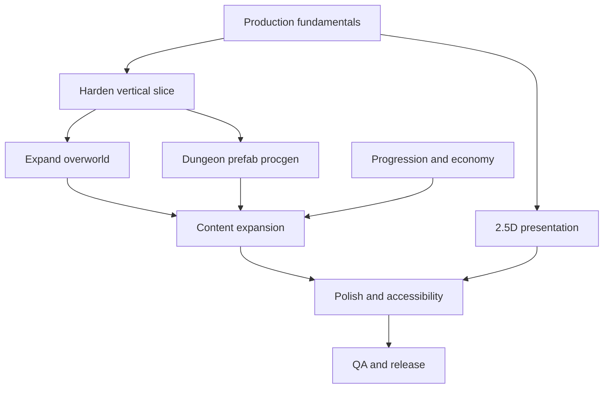

# Steps to complete the game

This document turns the design plan into an ordered checklist from the **current prototype** (Ebiten overworld + seeded dungeon graph + core combat/progression) toward a **cohesive, releasable** top-down adventure. Reorder steps when dependencies change; some items can run in parallel (e.g. art pipeline while tuning combat).

---

## 0. Baseline (already in the repo)

Use this as the starting line so future work is incremental, not duplicate.

- Ebiten game loop, 320×240 logical resolution, title → play → pause scenes.
- Tiled JSON maps under **`assets/maps/`** only (embedded at build via [`assets/embed_maps.go`](../assets/embed_maps.go)); object markers (spawn, enemy, pickup, door, shrine).
- Tile collision, sliding movement, sword swing, enemies, pickups, HUD, stamina sprint, dodge, hitstop, screenshake, placeholder SFX.
- Versioned save/load (`internal/save`); dungeon generation (`internal/dungeon`) is currently a CLI-only tool (`cmd/gentmj`) with no runtime integration.
- Five stats + shrine spend/heal (`internal/progression`, `internal/world`).
- Weekly epoch display (hook for future challenge seeds).

---

## 1. Lock production fundamentals

**Goal:** predictable builds, assets, and debugging.

**Status: done** — details live in the root **[README.md](../README.md)**.

1. ~~**Repository hygiene**~~ — [`.gitignore`](../.gitignore) ignores `save.json`, `bin/`, build artifacts, OS/editor noise. **[Makefile](../Makefile)** targets: `run`, `test`, `fmt`, `vet`, `clean`, `maps-check`, `build`.
2. ~~**Single asset pipeline**~~ — **Only** [`assets/maps/*.tmj`](../assets/maps/) is edited; maps embed from [`assets/embed_maps.go`](../assets/embed_maps.go). Rebuild (`go build` / `go run`) picks up changes—**no copy step**.
3. ~~**Runbook**~~ — README sections *How to play*, *Saving*, *Bug reports*, *Known limitations*.
4. ~~**Seed visibility**~~ — Pause shows `weekly_epoch` and player stats. **`C`** copies a bug digest (`map`, `hp`, `weekly` epoch, save path) via [atotto/clipboard](https://github.com/atotto/clipboard).

---

## 2. Vertical slice hardening (gameplay correctness)

**Goal:** one tight loop feels fair and readable before scaling content.

1. **Combat readability** — distinct wind-up or color/shape cues before enemy contact damage; tune invulnerability and knockback if you add it.
2. **Hitboxes** — document sword vs body boxes; optional debug draw toggle (not only sword).
3. **Damage rules** — i-frames, enemy hurt cooldowns, boss damage phases; avoid stunlock unless intentional.
4. **Death loop** — explicit design: checkpoint vs full heal vs currency tax; current respawn to field1 is a placeholder—replace with shrines, last safe bed, or dungeon entrance.
5. **Input** — gamepad support (`ebiten.Gamepad*`), debounce door triggers, remapping table (even if only a JSON file edited by hand at first).

---

## 3. Overworld: “open world” skeleton → full region

**Goal:** hand-authored world that feels contiguous and gated in a Zelda-like way.

1. **More screens** — expand from two overworld maps to a small region graph (5–15 screens); consistent tileset and biome read.
2. **Camera** — clamp to map bounds; optional edge scroll or centered camera modes.
3. **Transitions** — polish door cooldown, fade or wipe, spawn alignment so the player never appears inside a wall.
4. **Soft gates** — bombs, keys, items, or stamina-gated paths; each gate has a discoverable hint (crack pattern, NPC one-liner, color language).
5. **Points of interest** — repeatable shrines, one shop, optional stable/fast travel; keep economy sinks in mind (see section 6).
6. **Minimap** — region map or fog-of-war minimap tied to progression or item.

---

## 4. Dungeons: graph → real “room chunk” proc gen

**Goal:** match the plan—prefab rooms stitched by a generator—with solvable key/boss logic.

1. **Room library** — author N small Tiled rooms (combat, corridor, puzzle, reward) with door sockets (N/E/S/W tags in object layer or metadata).
2. **Graph instantiation** — map each generated node to a prefab instance; place rooms in a grid or packed layout; connect with corridors that match door directions.
3. **Lock/key on the real graph** — reintroduce **optional cycles** only after proving the locked edge is a **bridge** (or use articulation points / BFS cut checks); extend property tests beyond the current tree-only guarantees.
4. **Fallback generation** — if constraints fail, regenerate with a new sub-seed or fall back to a curated “emergency” layout (per plan).
5. **Dungeon identity** — tile variants or props per overworld region (mine vs grove) so proc floors still feel coherent with minimal story.
6. **Boss arena** — dedicated prefab or tagged room; boss intro space and exit after reward.

---

## 5. “2.5-D” presentation (plan: depth without 3D)

**Goal:** LTTP-style readability and charm.

1. **Sprites** — replace vector debug art with a consistent tileset + character sheets; 16×16 (or chosen) grid.
2. **Y-sorting** — draw order by foot Y for player, enemies, props, tall tiles.
3. **Layers** — ground / entity / canopy or roof layer; optional bridge layer with per-layer collision.
4. **Height fakes** — hop, ledges, one-way edges, stairs as animation + collision change.
5. **Lighting (optional)** — dark overlay + mask for torches; defer if scope is tight.
6. **UI typography** — replace `DebugPrint` with `text` + embedded font; scalable HUD.

---

## 6. Progression and economy (depth, not only +numbers)

**Goal:** orthogonal upgrades and reasons to spend currency.

1. **Stat breakpoints** — new moves, weapon classes, or traversal at thresholds—not only linear +1 damage.
2. **Fortune / Wits gameplay** — secret detection, better drop tables, scan/hint charges as in the plan.
3. **Sinks** — keys, maps, cosmetics, fast travel, repair, crafting materials; tune shrine prices per act.
4. **Risk/reward** — optional curse rooms, arenas, wager shrines (ties to “modern replayable” in the plan).
5. **New Game+ or run modifiers** — optional second pass with mutators once core loop is stable.

---

## 7. Content expansion (enemies, items, NPCs)

**Goal:** variety and teaching without scope explosion.

1. **Enemy taxonomy** — families (shielded, ranged, charger, swarm) each with a clear counter taught in a safe room first.
2. **Boss design** — 2–3 phases, one new rule per phase, recoverable mistakes; unique drops or unlocks.
3. **Item roster** — hookshot-analog, bow, dash boots—each opens map branches; track owned items in save with migrations.
4. **NPCs** — minimal dialogue; physical problems (broken bridge, rusted gate) not lore dumps.
5. **Pacing** — mix combat, puzzle, treasure, quiet traversal in dungeon templates; avoid monotone room chains.

---

## 8. Narrative and world coherence (minimal story)

**Goal:** everything the player does has a light in-fiction reason.

1. **One sentence per region** — biome + ruin + “who was here”; reflect in props and color.
2. **Dungeon cause** — each major dungeon theme matches an overworld problem (flooded mine, corrupted grove).
3. **Item fantasy** — names and pickup lines match the world tone.
4. **Environmental storytelling** — signs, corpses, murals—sparse, optional reads.

---

## 9. Polish and accessibility (ship quality)

**Goal:** juice and options that match modern expectations.

1. **Juice** — hitstop tuning, shake curves, particles, pickup magnet rules, screen flash limits.
2. **Audio** — music loops per context (field, dungeon, boss); stingers for discovery and low HP.
3. **Onboarding** — first 5–10 minutes teach move, map, interact, save, one combat pattern without text walls.
4. **Accessibility** — remappable controls, text size, color-blind telegraphs (shape + color), reduce motion / shake (you have a start—wire to a proper settings menu).
5. **Discoverability vs mystery** — choose a philosophy: automap reveal, pins, “?” markers—then implement consistently.
6. **Options menu** — volume, fullscreen, language placeholder, accessibility toggles.

---

## 10. Technical scaling (when the codebase grows)

**Goal:** keep velocity as systems multiply.

1. **Simulation vs render** — keep logic in `internal/world` (and siblings); avoid growing `internal/game` into a god package.
2. **Fixed timestep (optional)** — if physics gets heavier, split sim dt from render interpolation.
3. **Save migrations** — bump `save.CurrentVersion`, migrate old JSON fields on load.
4. **Profiling** — `pprof` or Ebiten’s built-in metrics; watch allocations in hot paths (Draw, collision).
5. **Platform** — if targeting WASM, validate embed paths, threading, and audio early; if Steam-only, defer WASM constraints.

---

## 11. QA, release, and live ops

**Goal:** shippable artifact and repeatable quality.

1. **Playtest script** — scenarios: new player, save/load, dungeon enter/exit, death, boss, economy drain.
2. **Automated tests** — extend dungeon tests; add save round-trip tests; optional golden-file tests for small maps.
3. **Build pipeline** — release binaries for macOS/Windows/Linux; codesign/notarization as needed.
4. **Store page / pitch** — short trailer, GIFs, bullet features aligned with what is actually in the build.
5. **Post-release** — crash reporting (if applicable), patch workflow, optional telemetry behind consent.

---

## Suggested milestone order (summary)

| Milestone | Outcome |
|-----------|---------|
| M1 | Production fundamentals + hardened slice + death/checkpoint design |
| M2 | Expanded overworld + minimap + polished transitions |
| M3 | Dungeon v1: prefab rooms + solvable locks with tests + boss arena |
| M4 | Presentation pass: sprites, Y-sort, layers, real UI text |
| M5 | Progression/economy depth + item-gated world |
| M6 | Content pass: enemy families, bosses, NPC problems |
| M7 | Polish, audio, accessibility, options |
| M8 | QA, builds, release |

Treat **M1–M3** as the critical path to a “real game” feel; **M4–M6** as the bulk of player-perceived quality; **M7–M8** as shipping discipline.

---

## Dependency graph (high level)

---

*Last aligned with repo layout: `assets` (embedded maps), `internal/game`, `internal/world`, `internal/dungeon`, `internal/tiled`, `internal/save`, `internal/progression`, `internal/render`.*
